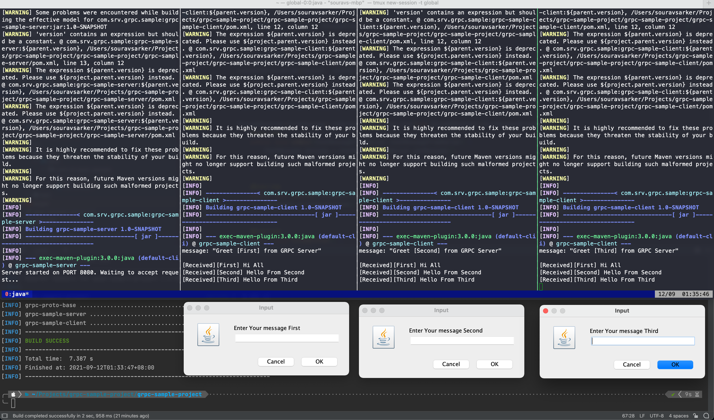

# grpc-sample-project

## System Requirements
```text
- JDK-1.8
- Maven-3.X.X
```

## Project Structure
```
grpc-sample-project
├── grpc-proto-base   --> Contains all the proto files under proto directory 
│  └── src/main/proto 
├── grpc-sample-client   --> grpc client logics are handled here -> depends on grpc-proto-base
│  └── src
├── grpc-sample-server   --> Server logs resides here -> depends on grpc-proto-base
│  └── src
├── pom.xml
├── README.md
└── src
```

## Test for development:

### Clean and build the project first
```bash
mvn clean package
```
This is the most important step

### Start Server
Server will start on port 8080
```bash
cd grpc-sample-server
mvn exec:java -Dexec.mainClass=com.srv.grpc.sample.ServerMain
```
 
### Start client
It's possible to start multiple clients.
Here is an example chat application. 

```bash
cd grpc-sample-client

# Start First User
mvn exec:java -Dexec.mainClass=com.srv.grpc.sample.ClientMain -Dexec.args=First

# Start Second User
mvn exec:java -Dexec.mainClass=com.srv.grpc.sample.ClientMain -Dexec.args=Second

# Start Third User
mvn exec:java -Dexec.mainClass=com.srv.grpc.sample.ClientMain -Dexec.args=Third
```

Four 4 terminal consoles are required to perform this test. Here is an screenshot of testing.



